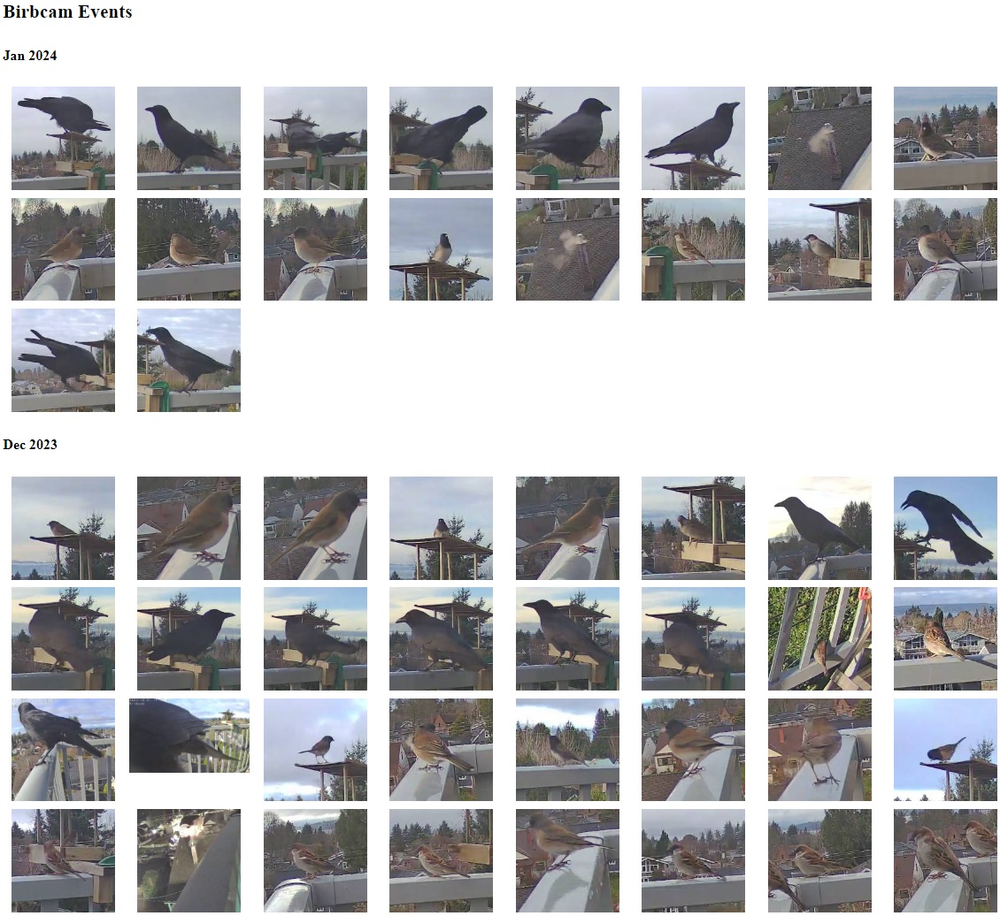

# Birb overview

I have a camera that tracks and captures small crop images of motion objects including birds.
It sees several types of birds (crows, juncos, finches, sparrows etc.) which I'd like to classify.


# Classfication Model Training

[Model training ipython notebook](bird_classify.ipynb)

Trained on the [Caltech-UCSD Birds-200-2011 (CUB-200-2011)](https://paperswithcode.com/dataset/cub-200-2011) dataset. It contains 11,788 images of 200 subcategories belonging to birds, 5,994 for training and 5,794 for testing.

We take a MobileNetV2 architecture with the last layer removed, replaced with dropout -> dense(200) -> dropout -> dense(70) for 70 groups of birds.


Generally it performs with 80% accuracy on the test dataset.

# Camera events

```json
[
    {"area":null,
    "box":null,
    "camera":"birbcam",
    "end_time":1704213300.999055,
    "false_positive":null,
    "has_clip":true,
    "has_snapshot":true,
    "id":"1704213243.00595-x47jwu",
    "label":"bird",
    "plus_id":null,
    "ratio":null,
    "region":null,
    "retain_indefinitely":false,
    "start_time":1704213238.00595,
    "sub_label":null,
    "top_score":0.82421875,
    "zones":[],
    "thumbnail":"<base64 encoded image>"},
    // ... more entries 
]

```

The camera provides the cropped images and associated metadata as an events JSON data file.
First, lets make a webpage that can load this JSON events file and do some simple visualizations.




## Running

`python -m http.server`
